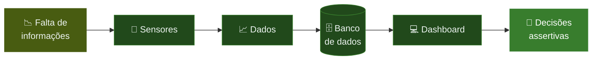

**Sensores de baixo custo para medir fluxo e interesse do consumidor em supermercados.**

## 🛒 Sobre o projeto

A **InfoConnect** monitora o **fluxo e o interesse do consumidor no varejo físico**. Sensores nas gôndolas medem a distância entre o cliente e a prateleira e registram, de forma automática e anônima, **quantas pessoas passam** e **quanto tempo ficam** diante de cada produto. Os dados vão para um banco de dados e aparecem em um dashboard, ajudando supermercados e marcas a decidir melhor sobre **promoções e posicionamento de produtos**, com baixo custo e mais ROI.

## 🔗 Links

<!-- 🔧 Substitua os "#" pelos links reais do grupo -->

| Documento | Link |
|---|---|
| Documentação | [Word](https://bandteccom-my.sharepoint.com/:w:/g/personal/fabricio_lima_sptech_school/IQC7hGp78pN3TYyNU8hrE9kaAbKvKtQYfQrLgdurBTe0jkU?e=JYOZTm) |
| Backlog | [Excel](#) |
| Tarefas | [Trello](https://trello.com/b/v9FwPukY/grupo-1-sprint-2) |
| Slides | [Apresentação](https://www.canva.com/design/DAHUdNX9vuU/XfZ0nVdsGCjIKe2flIXiyQ/edit) |
| Site Institucional | [Protótipo](https://www.figma.com/design/Xz9QYHZSdUI4lJbNYHU61Y/Prototipo-site---PI-Sprint-1?node-id=12-313&t=FWtlz2715xGLkSUN-0) |

## 👥 Equipe

**Turma 1 ADS A** · SPTech School

Bianca Melo · Fabricio Lima · 

